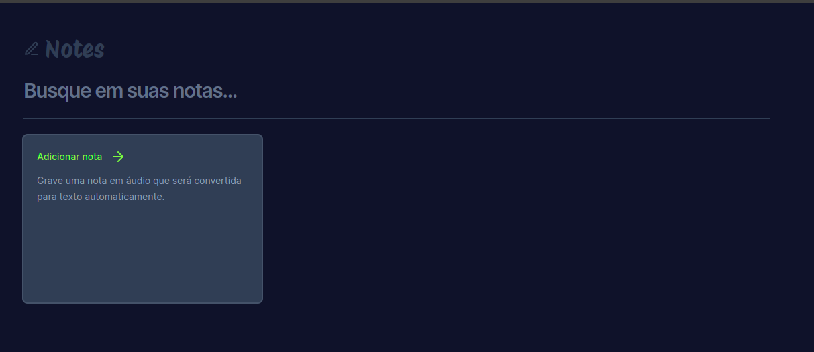
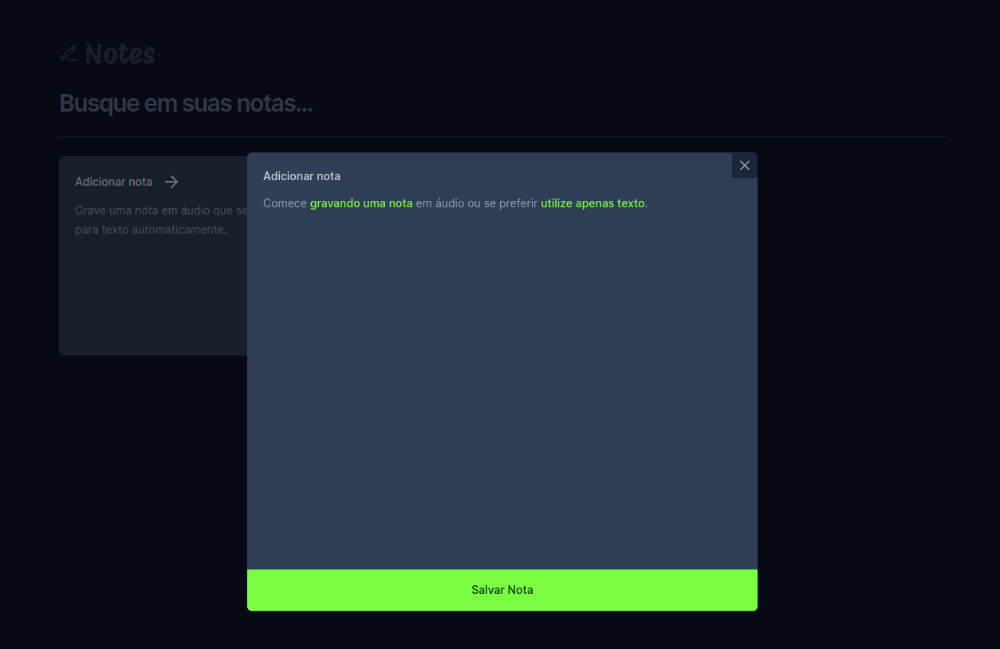
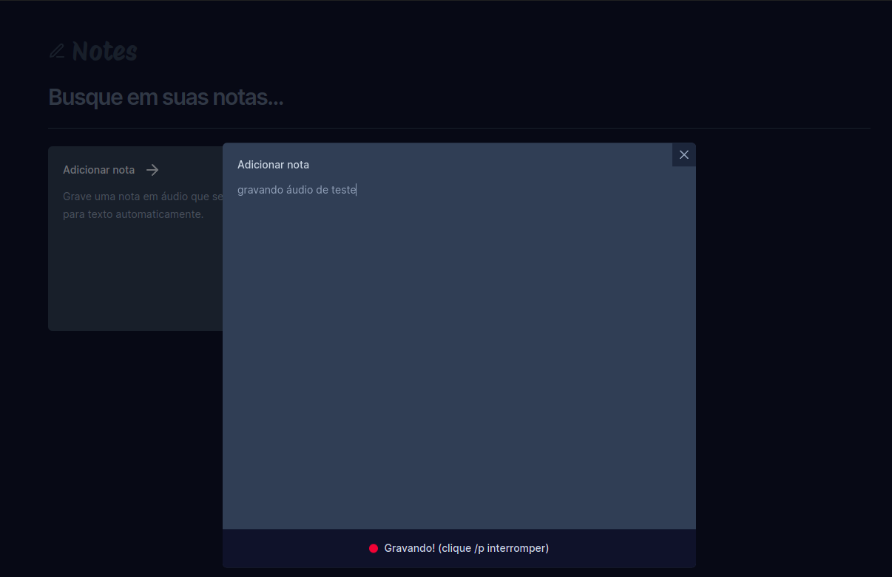
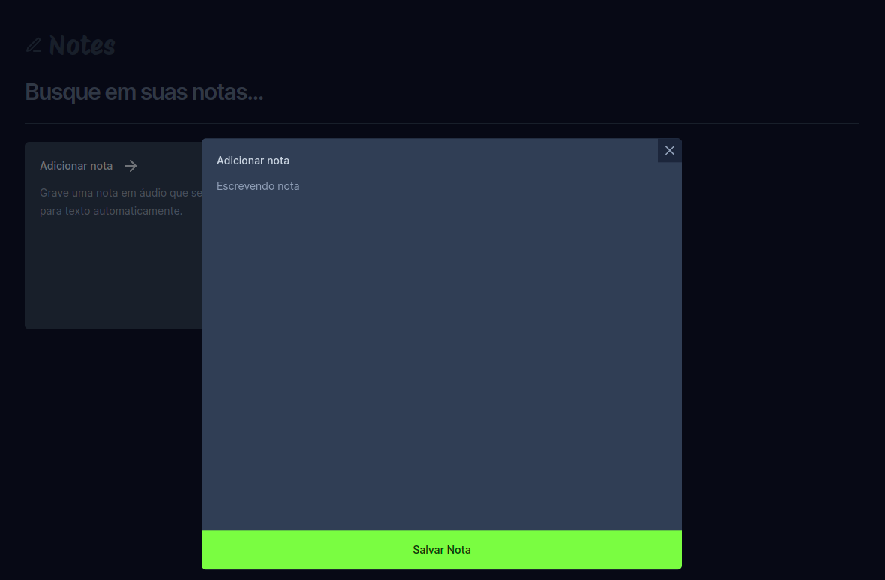

# Notes

Aplicativo para salvar anotações de áudio e texto. Desenvolvida utilizando React e Tailwind. Projeto proposto pela Rocketseat no evento NLW.

Primeira página:

  

Página de inclusão de notas:

  

Gravando nota:

  

Escrevendo nota:

  

Buscando nota:

  

  

Esse projeto foi desenvolvido com as seguintes tecnologias:

- React
- Tailwind
- Vite
- HTML
- JavaScript/TypeScript
- Git e Github
- Figma

